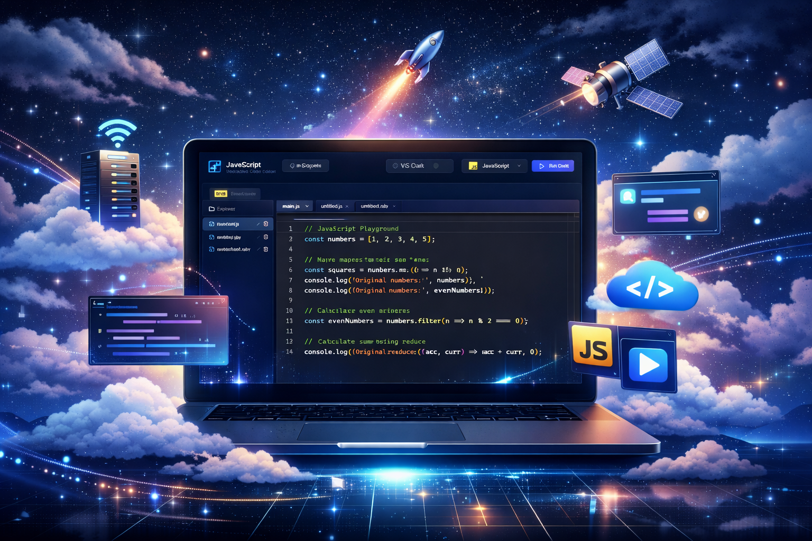
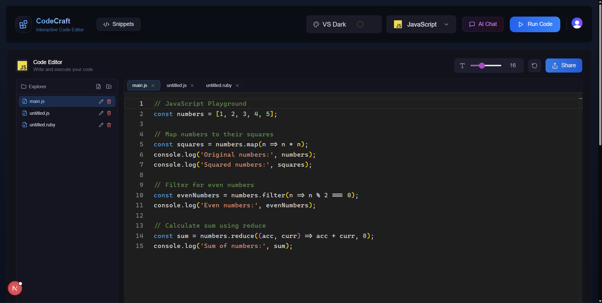
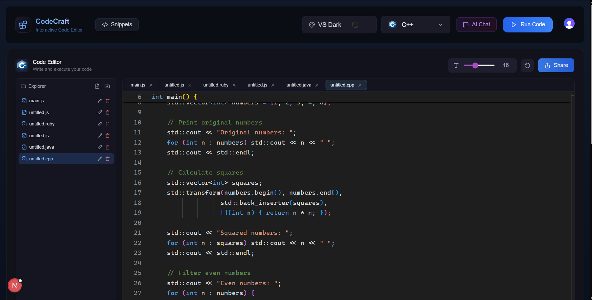

# ✨ CodeCraft - SaaS Code Editor ✨

CodeCraft is a modern, in-browser IDE built with Next.js 15, offering a seamless coding experience with powerful AI capabilities, real-time collaboration features, and a robust backend powered by Convex.

## Key Features

- **Advanced Code Editor**: Utilizes Monaco Editor, the engine behind VS Code, for a familiar and powerful editing experience with support for 5 themes and customizable font sizes.
- **Multi-Language Support**: Write and execute code in 9 different languages, including JavaScript, TypeScript, Python, Java, Go, Rust, C++, Ruby, and Swift.
- **AI-Powered Assistant**:
    - **AI Chat**: An integrated chat panel to ask questions about your code.
    - **Quick Actions**: Instantly explain, fix, or optimize selected code.
    - **AI Autocomplete**: Intelligent, inline code suggestions powered by Ollama.
- **Virtual File System**: Manage your project with a built-in file explorer that supports files and folders, with state persisted in local storage.
- **Code Snippet Sharing**: Share your code with the community by creating snippets. Others can view, comment on, and star your work.
- **User Profiles & Stats**: Track your coding activity with a personal profile page displaying execution history, favorite languages, and starred snippets.
- **Monetization Ready**: Integrated with Lemon Squeezy for handling Pro plan subscriptions, with free and pro tiers.
- **Authentication**: Secure user authentication and management handled by Clerk.

## Tech Stack

- **Framework**: Next.js 15 (React 19)
- **Backend & Database**: Convex
- **Authentication**: Clerk
- **AI Integration**: Ollama
- **Code Execution**: Piston (self-hosted via Docker)
- **UI**: Tailwind CSS & Framer Motion
- **Code Editor**: Monaco Editor
- **State Management**: Zustand
- **Payments**: Lemon Squeezy (via Webhooks)

## Prerequisites

Before you begin, make sure you have the following installed:

- [Node.js](https://nodejs.org/) (v18 or higher)
- [Docker Desktop](https://www.docker.com/products/docker-desktop/) (for code execution)
- [Ollama](https://ollama.com/) (for AI features — optional)
- Accounts on [Convex](https://convex.dev) and [Clerk](https://clerk.com)

---

## Getting Started

Follow these steps to get the project running locally.

### 1. Clone the Repository

```bash
git clone https://github.com/Hit1000/CodeCraft.git
cd CodeCraft
```

### 2. Install Dependencies

```bash
npm install
```

### 3. Set Up Environment Variables

Create a `.env.local` file in the root of your project and add the following:

```env
# Convex Deployment URL (get from convex.dev)
CONVEX_DEPLOYMENT=
NEXT_PUBLIC_CONVEX_URL=

# Clerk Authentication Keys (get from clerk.com)
NEXT_PUBLIC_CLERK_PUBLISHABLE_KEY=
CLERK_SECRET_KEY=

# Ollama AI Configuration (run Ollama locally)
NEXT_PUBLIC_OLLAMA_ENDPOINT=http://localhost:11434
NEXT_PUBLIC_AI_MODEL=deepseek-coder:1.3b

# Piston Code Execution (set after completing Step 4 below)
NEXT_PUBLIC_PISTON_API_URL=http://localhost:2000/api/v2/execute

## Optional
# CLERK_WEBHOOK_SECRET=
# LEMON_SQUEEZY_WEBHOOK_SECRET=
```

### 4. Set Up Piston (Code Execution Engine)

CodeCraft uses [Piston](https://github.com/engineer-man/piston) for secure, sandboxed code execution. You need Docker Desktop running for this step.

#### 4a. Start the Piston container

```bash
docker compose -f docker-compose.piston.yml up -d
```

Verify it's running:
```bash
docker logs piston_api
# Should show: API server started on 0.0.0.0:2000
```

#### 4b. Install language runtimes

Run each command and wait for a JSON response before running the next one (each takes ~30–60 seconds):

```bash
curl -X POST http://localhost:2000/api/v2/packages -H "Content-Type: application/json" -d "{\"language\": \"node\", \"version\": \"*\"}"
curl -X POST http://localhost:2000/api/v2/packages -H "Content-Type: application/json" -d "{\"language\": \"python\", \"version\": \"*\"}"
curl -X POST http://localhost:2000/api/v2/packages -H "Content-Type: application/json" -d "{\"language\": \"typescript\", \"version\": \"*\"}"
curl -X POST http://localhost:2000/api/v2/packages -H "Content-Type: application/json" -d "{\"language\": \"java\", \"version\": \"*\"}"
curl -X POST http://localhost:2000/api/v2/packages -H "Content-Type: application/json" -d "{\"language\": \"go\", \"version\": \"*\"}"
curl -X POST http://localhost:2000/api/v2/packages -H "Content-Type: application/json" -d "{\"language\": \"rust\", \"version\": \"*\"}"
curl -X POST http://localhost:2000/api/v2/packages -H "Content-Type: application/json" -d "{\"language\": \"gcc\", \"version\": \"*\"}"
curl -X POST http://localhost:2000/api/v2/packages -H "Content-Type: application/json" -d "{\"language\": \"ruby\", \"version\": \"*\"}"
curl -X POST http://localhost:2000/api/v2/packages -H "Content-Type: application/json" -d "{\"language\": \"swift\", \"version\": \"*\"}"
```

#### 4c. Verify installed runtimes

```bash
curl "http://localhost:2000/api/v2/runtimes"
```

> **Important:** After installing, check the version numbers returned and make sure they match the `pistonRuntime.version` values in `src/app/(root)/_constants/index.ts`. Update any mismatches.

#### 4d. Test execution

```bash
curl -X POST http://localhost:2000/api/v2/execute -H "Content-Type: application/json" -d "{\"language\": \"javascript\", \"version\": \"20.11.1\", \"files\": [{\"content\": \"console.log('hello')\"}]}"
# Expected: {"run":{"stdout":"hello\n",...}}
```

### 5. Set Up Ollama (AI Features — Optional)

Install [Ollama](https://ollama.com/) and pull a model:

```bash
ollama pull deepseek-coder:1.3b
```

Then start Ollama:
```bash
ollama serve
```

### 6. Run the Development Servers

You need to run **three** processes — open separate terminals for each:

**Terminal 1 — Next.js frontend:**
```bash
npm run dev
```

**Terminal 2 — Convex backend:**
```bash
npx convex dev
```

**Terminal 3 — Piston (if not already running):**
```bash
docker compose -f docker-compose.piston.yml up
```

Open [http://localhost:3000](http://localhost:3000) in your browser.

---

## Piston Management

| Command | Description |
|---|---|
| `docker compose -f docker-compose.piston.yml up -d` | Start Piston in background |
| `docker compose -f docker-compose.piston.yml down` | Stop Piston |
| `docker logs piston_api` | View Piston logs |
| `curl "http://localhost:2000/api/v2/runtimes"` | List installed languages |

> **Note:** Piston must be running whenever you use the code execution features. Docker Desktop must also be open.

---

## Project Structure

- `convex/`: Contains all backend logic, including database schema, queries, mutations, and actions.
- `src/app/`: The main application code, following the Next.js App Router structure.
  - `(root)/`: The primary editor interface.
  - `api/execute/`: Server-side proxy route that forwards code to the local Piston instance (avoids CORS).
  - `challenges/`: Coding challenge pages with test case execution.
  - `profile/`: User profile page with stats and execution history.
  - `snippets/`: Pages for browsing, viewing, and commenting on shared code snippets.
  - `pricing/`: The pricing page for the Pro plan.
- `src/components/`: Shared React components used across the application.
- `src/store/`: Zustand store (`useCodeEditorStore`) for global state management of the editor, file system, and AI features.
- `src/lib/ai/`: Contains the `OllamaService` for handling communication with the local Ollama AI model.
- `docker-compose.piston.yml`: Docker Compose config for the Piston code execution engine.

## Images



## License

This project is licensed under the MIT License. See the [LICENSE](LICENSE) file for details.